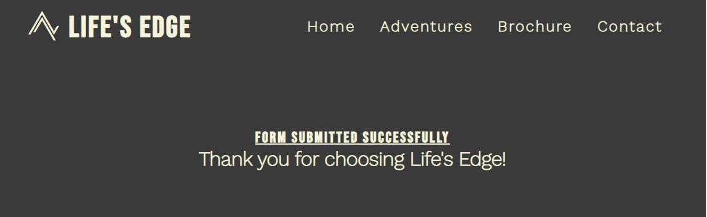

<!--About the Company-->
# Life's Edge
## About The Company:
- Life's Edge is an adventure guide company offering a wide range of services that include, Mountain climbing, Ocean Sports, Air Sports and Hiking.

## Project Description:
- The purpose of this project is to build an accessible and visually appealing website for Life's Edge adventure company.
- The main goal is to present relevant information on the services Life's Edge provides to new and existing clients, in an intuitive and easy way.

<!--index.html-->
# index.html
## Page Header:
- The header of the webpage consists of a Main Life's Edge Logo and Navigation Bar. The logo acts as a homepage link and uses the Bebas Neue font and an Icon from Font Awesome.
 - The Navigation Bar consists of links to the HOME, ADVENTURES, BOOKING and CONTACT sections of the website.

## Landing-Page Image:
- The landing page image is a free to use winter mountain panorama stock photo from Pixabay.com. The landing image is designed to illicit a positive response from users by using an animation that creates an inviting zoom effect on loading the page.

## Why Life's Edge Section:
- This section is designed to present information about why this company is the right choice for the user. By using a combination of well-structured text content and visual cues such as an inspirational image and Font Awesome Icons.

## Contact Section:
- The purpose of the contact section is to provide all relevant contact information to the user, in a clear and simple fashion, using an easy-to-read color scheme and Font Awesome Icons.

## Page Footer:
- The page footer consists of links to social media sites that open in a new tab and are made more visually appealing using official logos of each social media site.

<!--adventures.html-->
# adventures.html
## Page header:
- The page headers remain consistent across the website to provide a more positive and consistent user experience.

## Adventures Page Content:
- The adventures.html file consists of a background image of a climber covering the width of the viewport, with lists containing all the activities Life's Edge offers its clients, designed to be clear, informative and visually appealing to the user.

## Page Footer:
- The footers remain consistent across the website to provide a more positive and consistent user experience.

<!--form.html-->
# form.html
## Page header:
- The page headers remain consistent across the website to provide a more positive and consistent user experience.

## Submition Form:
- The form.html file consists of a background image to cover the view port and various inputs for submitting information. The purpose of this file is to provide a form for the user to submit to receive a personalised brochure based on their area of interest, so the user can view price breakdowns and cater a package to suit their needs.

## Page Footer:
- The footers remain consistent across the website to provide a more positive user experience.

<!-- thanks.html -->
# thanks.html 

## Header
- The page headers remain consistent across the website to provide a more positive and consistent user experience.

## Thank You Messege
- The thank you page is the action for the form.html submition form, and loads a thank you messege upon submition of the brochure form in the form.html file.

<!--style.css-->
# style.css
## Stylesheet:

- The style.css file acts as the stylesheet across all pages of the site and keeps in mind UX design to keep the styles, animations, color schemes and responsive design features consistent across all pages and promote a positive user experience.

<!--Testing-->
# Testing
## W3C Validation:
- HTML - All files passed W3C validation with no warnings or errors in code.

- CSS - All files passed W3C validation with no warnings or errors in code.

## LightHouse in Chrome DevTool's:
- After analysing code in lighthouse, the site performs consistently and is very accessible on both desktop and mobile devices.
- index.html:

- adventures.html:

- form.html:

- thanks.html:

<!-- Future Updates-->
# Potential Future Updates
## Gallery Section:
- A gallery section would be an excellent update to make to the site in future to add more positive user experience to the site, as past client images will attract new clients to the company and its services, while also making the site even more appealing to the user visually.

## Review section:
- A review section would make an excellent future update to the site, as past client reviews are likely to convince new and existing clients of not only the benefits of using Life's Edge services but also peace of mind in booking services knowing many past clients have a positive experience to share with others.

## Video Testimonials:
- In addition to a review section, a section for video testimonials from clients as they carry out the activities of their choice will be a positive future update to the website, as this will promote attaining new clients and gives new and existing clients a real look at what Life's Edge are offering.

<!-- Debugging -->
# Debugging
## Debugging with DevTools 
- Chrome DevTools were used in the debugging process to find and fix unusual behaviour, and while implementing responsive design for different device widths.

## Debugging with W3C Validation
- Attempts at validating html and css code uncovered any substandard code to be fixed to pass validation.

<!-- Bugs and Fixes -->
# Bugs and Fixes
## Break Points
- After extensive testing in Chrome DevTools, unusual break points in the reponsivness of some elements were discovered.
- Using media queries these break points were fixed by targeting the width of the device screen at the time the elements break.

## Broken Nav Link
- After initial testing it was clear the contact nav link only worked on index.html but not from other html files.
- Checking href attributes showed a slash in the file path was causing an error. The file path was edited and contact nav links now work across all files.

<!-- Credits -->
# Credits
- Parts of the code for home-page image zoom animation were taken from Code Institutes - Love Running.
- All images used across the site are free to use stock images from Pixabay.com

<!-- Deployment -->
# Deployment
## GitHub Pages:
- Firstly a final debugging and grammar check was carried out.
- The website was deployed to github pages and is now live.
- The live website behaves as intended with no funtionality issues found.
[Live Link](https://davidcoreh.github.io/Lifes-Edge-Repository/)