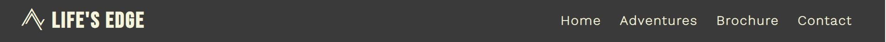

<!--About the Company-->
# Life's Edge
## About The Company:

Life's Edge is an adventure guide company offering a wide range of services that include, Mountain climbing, Ocean Sports, Air Sports and Hiking.

## Project Description:

The purpose of this project is to build an accessible and visually appealing website for Life's Edge adventure company.

The main goal is to present relevant information on the services Life's Edge provides to new and existing clients, in an intuitive and easy way.

<!--index.html-->
# index.html
## Page Header:

The header of the webpage consists of a Main Life's Edge Logo and Navigation Bar. The logo acts as a homepage link and uses the Bebas Neue font and an Icon from Font Awesome.

The Navigation Bar consists of links to the HOME, ADVENTURES, BOOKING and CONTACT sections of the website.

## Landing-Page Image:</h2>

The landing page image is a free to use winter mountain panarama stock photo from Pixabay.com. The landing image is designed to ilicit a positive response from users by using an animation that creates an inviting zoom effect on loading the page.

## Why Life's Edge Section:

This section is designed to present information about why this company is the right choice for the user. By using a combination of well structured text content and visual cues such as an inspirational image and Font Awesome Icons.

## Contact Section:

The purpose of the contact section is to provide all relevant contact information to the user, in a clear and simple fasion, using an easy to read color scheme and Font Awesome Icons

## Page Footer:

The page footer consists of links to social media sites that open in a new tab and are made more visually appealing using official logos of each social media site.

<!--adventures.html-->
# adventures.html
## Page header:

The page headers remain consistent across the website to provide a more positive user experience.

## Adventures Page Content:

The adventures.html file consists of a free to use background image of a climber from pixabay.com, with lists containing all the activities Life's Edge offers its clients, designed to be clear and visually appealing to the user.

## Page Footer:

The footers remain consistent across the website to provide a more positive user experience.

<!--booking.html-->
# booking.html
## Page header:

The page headers remain consistent across the website to provide a more positive user experience.

## Booking Form:

The booking.html file consists of a background image to cover the view port and various inputs for submiting information. The purpose of this file is to provide a form for the user to submit to recieve a personalised brochure based on there area of interest, so the user can view price breakdowns and cater a package to suit their needs.

## Page Footer:

The footers remain consistent across the website to provide a more positive user experience.

<!--style.css-->
# style.css
## Stylesheet:

This style.css file acts as the style sheet across all pages of the site and keeps in mind UX design to keep the styles, animations and color schemes consistent across all pages and promote a positive user experience.

 

<!--Testing-->
# Testing
## W3C Validation:

HTML - All files passed W3C validation with no warnings or errors in code

CSS - All files passed W3C validation with no warnings or errors in code

## LightHouse in Chrome DevTool's:

After analysing code in lighthouse it is clear the website performs consistently and is very accessible to users

## User Survey:

Ten test users where asked to give an opinion on how the site performs and looks in preview. All 10 reported that they would recommend the site to others and that the style and structure promoted a positive experience on the website. With only 2 reporting that a gallery page would be a nice edition to the site to show past client experiences

# Potential Future updates
## Gallery Section:

Based on user feedback, a gallery section would be an exellent update to make to the site in future to add more positive user experience to the site, as past client images will attract new clients to the company and its services, while also making the site even more appealing to the user visually.

## Review section:</h2>

A review section would make an exellent future update to the site, as past client reviews are likly to convince new and existing clients of not only the benefits of using Life's Edge services but also peace of mind in booking services knowing many past clients have a positive experience to share with others.

## Video Testimonials:

In addition to a review section, a section for video testimonials from clients as they carry out the activities of their choice will be a positive future update to the website, as this will promote attaining new clients and gives new and existing clients a real look at what Life's Edge are offering to their clients.

# Deployment

# Credits